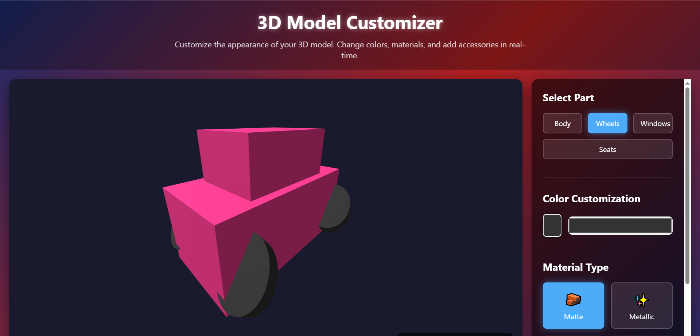
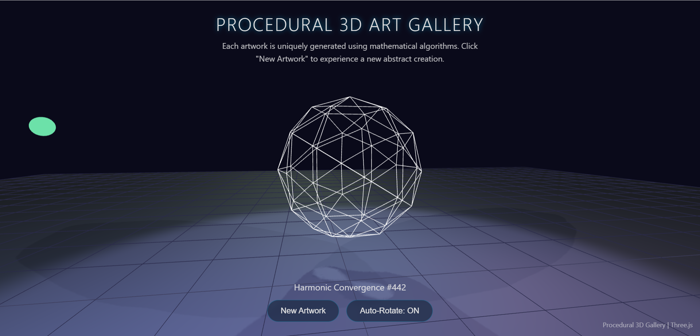
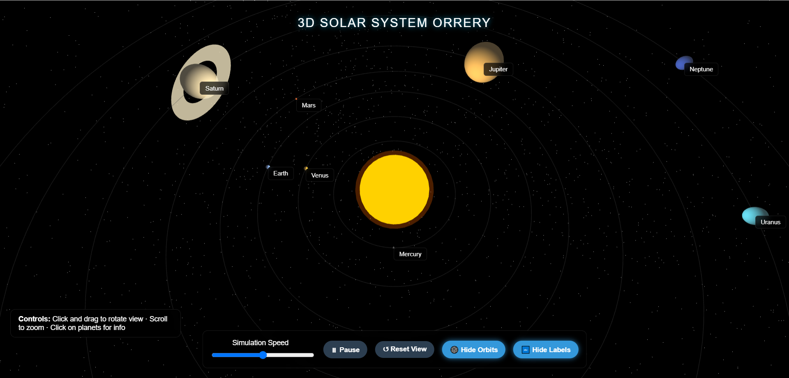
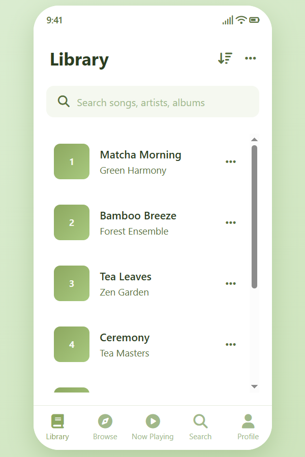

# DeepSeek R1 Web Development Demo 🌟

This project demonstrates the capabilities of the DeepSeek R1 model in modern web development. Through multiple interactive scenarios including 3D applications and mobile UI prototypes, we validate the model's performance in developing complex web applications.

## 🚀 Test Scenarios

### 1. Interactive 3D Product Customizer 🛍️✨
**File**: `3d-product-customizer.html`  



**Features**:
- 3D model loading and rendering (GLTF format support)
- Real-time color customization
- Material switching (matte, metallic, fabric, etc.)
- Smooth camera controls (orbit, zoom, pan)
- Intuitive user interface design

### 2. Procedurally Generated 3D Art Gallery 🖼️🌀
**File**: `3d-art-gallery.html`  



**Features**:
- Procedural geometry generation
- Dynamic scene generation system
- Colorful dynamic lighting effects
- Camera animations and transitions
- Virtual gallery navigation experience

### 3. Mini 3D Solar System Orrery 🌌🪐
**File**: `3d-solar-system.html`  



**Features**:
- Multi-planetary system rendering
- Realistic orbital mechanics simulation
- Interactive planetary information display
- Adjustable simulation speed control
- Starry background and lighting effects

### 4. iOS Music Player Prototype 🎵📱
**File**: `ios-music-player-matcha.html`  



**Features**:
- Native iOS-style interface design
- Matcha green theme with modern aesthetics
- Complete music player functionality
- Multi-tab navigation (Library, Browse, Now Playing, Search, Profile)
- Interactive controls and animations
- Responsive mobile-first design

## 🛠️ Tech Stack

**3D Applications**:
- **Three.js**: 3D graphics rendering engine
- **WebGL**: Hardware-accelerated graphics processing
- **HTML5 Canvas**: Rendering surface

**Mobile UI Prototypes**:
- **CSS Grid & Flexbox**: Modern layout systems
- **CSS Custom Properties**: Dynamic theming
- **Font Awesome**: Icon library
- **CSS Animations**: Smooth transitions and interactions

**Common Technologies**:
- **Modern CSS**: Responsive interface design
- **JavaScript ES6+**: Interactive logic implementation
- **HTML5**: Semantic markup

## 📊 Test Results

DeepSeek R1 model excels in the following aspects:

✅ **Code Quality**: Generated code is well-structured and follows best practices  
✅ **Feature Completeness**: All required features are fully implemented  
✅ **User Experience**: Beautiful interface design with smooth and natural interactions  
✅ **Performance Optimization**: Code is optimized for smooth execution  
✅ **Compatibility**: Supports modern browsers with responsive design  
✅ **Mobile UI Design**: Pixel-perfect iOS-style interfaces with native feel  
✅ **Design Systems**: Consistent theming and component architecture  

## 🎯 Usage Instructions

1. Open any HTML file directly in your browser
2. Ensure stable internet connection (requires Three.js CDN loading)
3. Use mouse to interact with 3D scenes
4. Experience various customization and control features

## 📝 Project File Structure

```
deepseek-r1-demo/
├── 3d-product-customizer.html          # Product customizer scene
├── 3d-art-gallery.html                 # Art gallery scene  
├── 3d-solar-system.html                # Solar system scene
├── ios-music-player-matcha.html        # iOS music player prototype
├── 3d-product-customizer-screenshot.png # Product customizer screenshot
├── 3d-art-gallery-screenshot.png       # Art gallery screenshot
├── 3d-solar-system-screenshot.png      # Solar system screenshot
├── ios-music-player-matcha-screenshot.png # iOS music player screenshot
├── scenario-1-product-customizer.md    # Product customizer documentation
├── scenario-2-art-gallery.md           # Art gallery documentation
├── scenario-3-solar-system.md          # Solar system documentation
├── README.md                           # Project documentation
└── LICENSE                             # Open source license
```

## 🔗 Related Links

- [DeepSeek Official Website](https://www.deepseek.com/)
- [Three.js Official Documentation](https://threejs.org/)
- [WebGL Specification](https://www.khronos.org/webgl/)

---

*This project showcases the powerful capabilities of AI-assisted development in both complex 3D web applications and modern mobile UI prototypes, providing valuable reference cases for future human-AI collaborative development.*